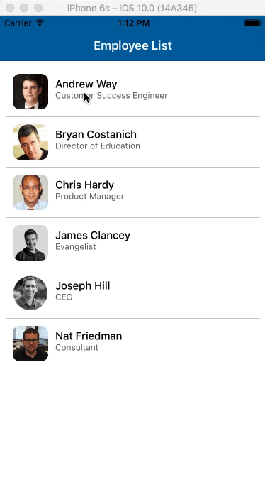

# React-Native : Sample App
Sample Employee Directory application on React Native using [react-native-router-flux](https://github.com/aksonov/react-native-router-flux#try-the-example-app)



## Installation

**Step 1:** clone my repo & cd into project

**Step 2:** install node modules

```
npm install
```

*Before run android build, setup [Android Studio](https://facebook.github.io/react-native/docs/android-setup.html)*

**Step 3:** If Android

```
react-native run-android
```

*Before running iOS build, Install [Xcode](https://developer.apple.com/xcode/download/)*

**Step 4:** If iOS

```
react-native run-ios
```

If you want to install app in the device, connect your device to the system with debugger mode on and run the above command, app will be installed automatically.
